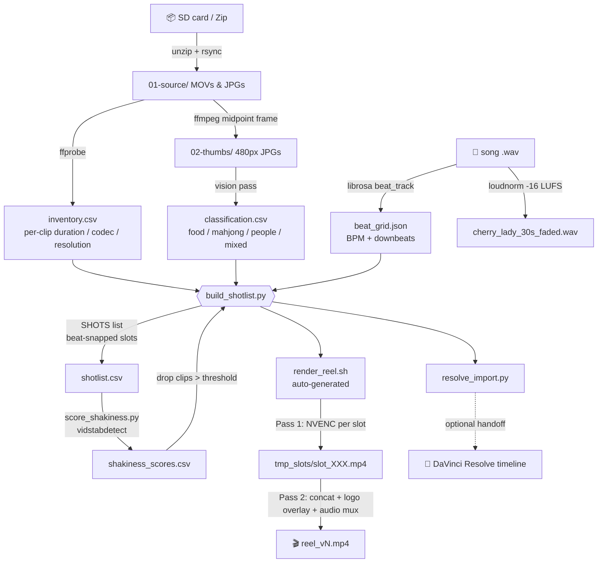
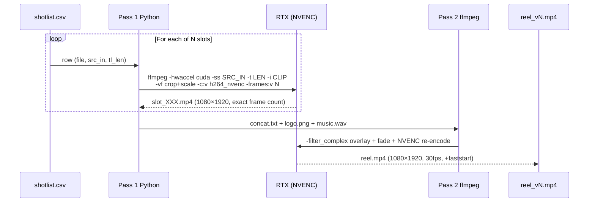
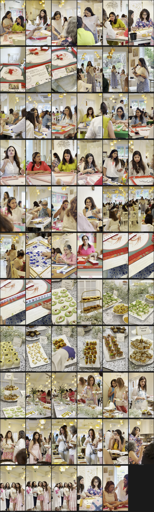

# reel-edit-pipeline

<p align="center">
  
</p>

<p align="center"><i>A reusable GPU-accelerated reel-builder for events, drone shoots, and any short-form video where you have lots of clips and want a beat-locked 30-ish-second cut.</i></p>

<p align="center">
  
  
  
  
</p>

---

## What this is

A scriptable pipeline that turns a folder of raw event footage into a polished vertical reel, with:

- **Beat-locked cuts** synced to music BPM (librosa)
- **Vision-tagged classification** (food / mahjong / people / mixed) so you can exclude categories
- **Auto-detected shaky clips** dropped via vidstabdetect feature-point analysis
- **GPU-accelerated render** via NVENC (300+ fps on an RTX 3070 for 1080p H.264)
- **Persistent brand watermark** + a configurable end card with fade-out
- **DaVinci Resolve export** as a bonus — produces a `resolve_import.py` to recreate the timeline inside Resolve

Built for "The Drone Agency" + Fia's Lounge. Used in production for the **Mother's Day Mahjong 2026** event reel — that project is included as the working example.

---

## The pipeline



## Two-pass NVENC render — why?



A naive single-pass `-filter_complex concat=N=33` opens all 33 source videos simultaneously → OOM kill (HEVC 4K decoders are RAM-hungry). The two-pass approach keeps memory flat: one NVENC encode at a time, then stream-copy + overlay in the second pass.

## Iteration timeline (this project's actual history)

```mermaid
gantt
    title Mother's Day Mahjong 2026 reel — v1 → v9
    dateFormat HH:mm
    axisFormat %H:%M
    section v1
      First cut (33 clips, 30s)       :v1, 12:09, 4m
    section v2
      Fia opener + shaky swaps        :v2, 12:23, 4m
    section v3
      Logo overlay + split close      :v3, 12:27, 2m
    section v4
      Brand-card src_in tuning        :v4, 12:29, 2m
    section v5
      Swap IMG_3488 for IMG_3478      :v5, 12:31, 3m
    section v6
      Fix NVENC GOP drift bug         :v6, 12:34, 3m
    section v7
      Placard + wide-table opening    :v7, 12:43, 5m
    section v8
      Auto-drop 4 shaky clips         :v8, 12:48, 4m
    section v9
      Remove JPGs (zero stills)       :v9, 12:53, 4m
```



---

## Quick start

```bash
# 1. Install deps (Ubuntu/Debian)
sudo apt install ffmpeg imagemagick python3 python3-pip
pip install --user librosa yt-dlp

# 2. Confirm GPU + NVENC
nvidia-smi
ffmpeg -encoders 2>/dev/null | grep nvenc
# you should see h264_nvenc, hevc_nvenc, av1_nvenc

# 3. Set up a project folder
mkdir -p ~/projects/my-event/{01-source,02-thumbs,03-music/assets,04-edit,05-renders}

# 4. Drop your clips into 01-source/, your logo into 03-music/assets/logo.png,
#    and a beat-analyzed music WAV into 03-music/

# 5. Edit pipeline/build_shotlist.py:
#    - update ROOT path at the top
#    - rewrite the SHOTS list for your event's beats

# 6. Build + render
python3 pipeline/build_shotlist.py        # generates shotlist.csv + render_reel.sh
bash 04-edit/render_reel.sh               # renders 1080×1920 reel via NVENC

# 7. (Optional) Auto-drop shaky clips
python3 pipeline/score_shakiness.py       # scores every slot, writes shakiness_scores.csv
# Read the top of the output, add high-scoring clips to SHAKY_DROP in build_shotlist.py
# Re-run steps 6.
```

---

## Output gallery — Mother's Day Mahjong 2026 reel

| t=0s | t=1s | t=5s |
|:---:|:---:|:---:|
|  |  |  |
| Fia on mic, hero opener | MAHJONG @ FIA'S LOUNGE card | Build section |

| t=11s | t=22s | t=25s |
|:---:|:---:|:---:|
|  |  |  |
| Hook section | Closing sequence | Logo end card (fade out) |

### Source contact sheet (65 video thumbnails, 22 JPG photos)



---

## How the SHOTS DSL works

The heart of `build_shotlist.py` is a single Python list:

```python
SHOTS = [
    # (tl_in, tl_out, role, preferred_tags, label, force_file?, force_src_in?)
    (b(0),  b(1),  "open",   ["people"],  "Fia on mic",            "IMG_3491.MOV"),
    (b(3),  b(6),  "open",   ["mahjong"], "Wide table + signage",  "IMG_3488.MOV", 0.0),
    (b(6),  b(9),  "build",  ["people"],  "Player seated",         "IMG_3479.mov"),
    (b(9),  b(12), "build",  ["mahjong"], "Tiles shuffled",        None),   # picker chooses
    # ...
    (b(52), 30.0,  "close",  [],          "Logo end card fade-out", "LOGO_END_CARD"),
]
```

Fields:

| Field | Required | Description |
|---|---|---|
| `tl_in`, `tl_out` | yes | Timeline in/out in seconds. Use `b(N)` for beat-snapped positions. |
| `role` | yes | Free-form label (`open`, `build`, `hook1`, `hook2`, `mid`, `close_b`, `close`). |
| `preferred_tags` | yes | List from `classification.csv` — picker prefers these tags. |
| `label` | yes | Human-readable note (shows up in shotlist.md). |
| `force_file` | no | Specific file to use. `None` = greedy picker chooses. `"LOGO_END_CARD"` = sentinel for the fade end card. |
| `force_src_in` | no | Override center-fit and start the clip at this timestamp. Useful when only part of a clip is the good take. |

The picker is greedy: longest matching unused clip in the preferred tag pool. Forced files are reserved before the picker runs so they don't get re-assigned elsewhere.

---

## Skills used

| Layer | Tech | Purpose |
|---|---|---|
| **Decode/encode** | `ffmpeg` 6.0+ with `--enable-libnpp --enable-nvenc --enable-cuvid` | All video I/O |
| **GPU acceleration** | NVIDIA NVENC + NVDEC (CUDA 13.0, driver 580+) | H.264/HEVC encode at 300+ fps |
| **Music analysis** | `librosa` 0.10+ (`beat_track`, `onset_strength`, `agglomerative`) | BPM, downbeat grid, chorus detection |
| **Audio normalization** | `ffmpeg loudnorm` filter (EBU R128) | -16 LUFS for Instagram/TikTok spec |
| **Source acquisition** | `yt-dlp` | Audio extraction from streaming sources |
| **Stabilization detect** | `ffmpeg vidstabdetect` (libvidstab) | Per-clip shakiness scoring |
| **Filter graph** | ffmpeg filter complex (`concat`, `overlay`, `zoompan`, `fade`, `crop`, `scale_cuda`, `format`) | Logo overlay + Ken Burns + fades |
| **Container** | MP4 with `+faststart` moov atom | Progressive web playback |
| **Vertical reframe** | Center-crop landscape→9:16 via `crop=ih*9/16:ih` | 1080×1920 from 3840×2160 sources |
| **Frame-exact slots** | `-frames:v N` instead of `-t` | Avoids NVENC GOP drift across 30+ slots (the v6 bug fix) |
| **End card** | `lavfi color` + `overlay` + `fade` | Black background + centered logo + 1s fade-out |
| **Resolve handoff** | DaVinci Resolve Scripting API (`DaVinciResolveScript`) | Optional — pulls clips + music into a fresh timeline |
| **Vision tagging** | Multimodal LLM via thumbnail review | Tags each clip as food/mahjong/people/mixed |
| **Project layout** | `01-source/`, `02-thumbs/`, `03-music/`, `04-edit/`, `05-renders/` | Reproducible folder convention |

---

## Project structure

```
reel-edit-pipeline/
├── README.md                                   ← this file
├── .gitignore                                  ← excludes footage, music, renders
├── LICENSE
├── pipeline/
│   ├── build_shotlist.py                       ← THE engine: SHOTS → CSV + render_reel.sh + resolve_import.py
│   └── score_shakiness.py                      ← per-slot vidstabdetect scorer
└── examples/
    └── mothers-day-mahjong/
        ├── assets/
        │   └── logo_mahjong_fias.png           ← brand watermark
        ├── metadata/
        │   ├── inventory.csv                   ← per-clip codec/resolution/duration
        │   ├── classification.csv              ← per-clip vision tags + note
        │   ├── exclude.txt                     ← food clips dropped from pool
        │   ├── beat_grid.json                  ← Cherry Cherry Lady BPM + downbeats
        │   ├── analyze.py                      ← librosa analysis script
        │   ├── edit_notes.md                   ← BPM cheat sheet for editor
        │   └── shakiness_scores.csv            ← per-slot vidstabdetect scores
        └── shotlists/
            ├── shotlist_v1.csv                 ← first cut, 33 slots, 30s
            ├── shotlist_v2.csv                 ← Fia opener + shaky swaps
            ├── shotlist_v3.csv                 ← logo overlay + split close
            ├── shotlist_v4.csv                 ← brand-card src_in tuning
            ├── shotlist_v6.csv                 ← NVENC GOP drift fix
            ├── shotlist_v7.csv                 ← placard + wide-table opening
            ├── shotlist_v8.csv                 ← auto-drop 4 shaky clips
            └── shotlist_v9_final.csv           ← no JPGs (current production cut, 25.6s)
```

---

## Performance reference (RTX 3070, 8 GB)

| Operation | Throughput |
|---|---|
| H.264 NVENC 1080p (preset p4) | ~360 fps (12× realtime) |
| HEVC NVENC 1080p (preset p7) | ~147 fps (4.9× realtime) |
| Full 30-sec reel render (34 slots, 2-pass) | ~52 seconds end-to-end |
| HEVC NVDEC 4K decode | well above realtime |
| vidstabdetect scoring (33 clips) | ~25 seconds total |

For the system spec story behind the optimizations, see the comments inside `pipeline/build_shotlist.py` (look for the `# v6` and `# v8` markers).

---

## Adapting for a new event

1. **Copy** `examples/mothers-day-mahjong/` → `examples/your-event/`
2. **Replace** `assets/logo_*.png` with your event/brand mark
3. **Replace** `metadata/` files: run the data-prep flow on your footage (ffprobe inventory, vision-tag thumbnails, music BPM analysis)
4. **Rewrite** `build_shotlist.py`'s `SHOTS` list for your beats and your clip filenames
5. **Update** the `ROOT` constant near the top of both scripts to point at your project root
6. Run `python3 pipeline/build_shotlist.py && bash 04-edit/render_reel.sh`

The Mother's Day Mahjong example acts as a template — copy and modify.

---

## Known limitations

- Hard-coded project root in `build_shotlist.py` — change the `ROOT = Path(...)` line per project (or env-var-ify it)
- The greedy picker prefers length over visual quality — for hero slots, force the file explicitly
- Vision tagging is manual today (run a multimodal LLM over the contact sheet, paste into classification.csv)
- `vidstabdetect` scores are noisy on short (< 1 sec) clips — use motion-magnitude trends rather than absolute thresholds
- DaVinci Resolve Free can import the timeline but blocks NVENC delivery render (Studio only)

---

## Credits

Built by [@Piyushmishra29](https://github.com/Piyushmishra29) for **The Drone Agency** (Bangalore, DGCA-certified drone services since 2020) and **Fia's Lounge**.

Original use case: Mother's Day Mahjong tournament hosted at Fia's Lounge, 11 May 2026.

Pipeline assembled with [Claude Code](https://claude.com/claude-code) (Opus 4.7, 1M context).

## License

MIT — see [LICENSE](LICENSE)
